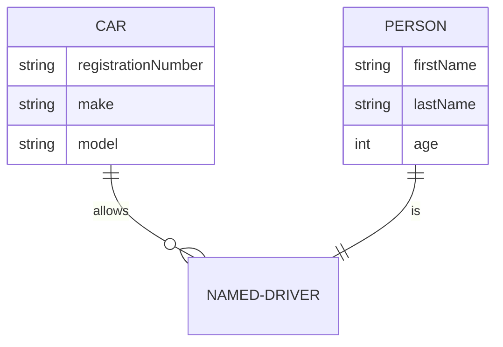

```mermaid 
erDiagram 
    CAR ||--o{ NAMED-DRIVER : allows 
    CAR { string registrationNumber string make string model } 
    PERSON ||--|| NAMED-DRIVER : is 
    PERSON { string firstName string lastName int age } 
```

