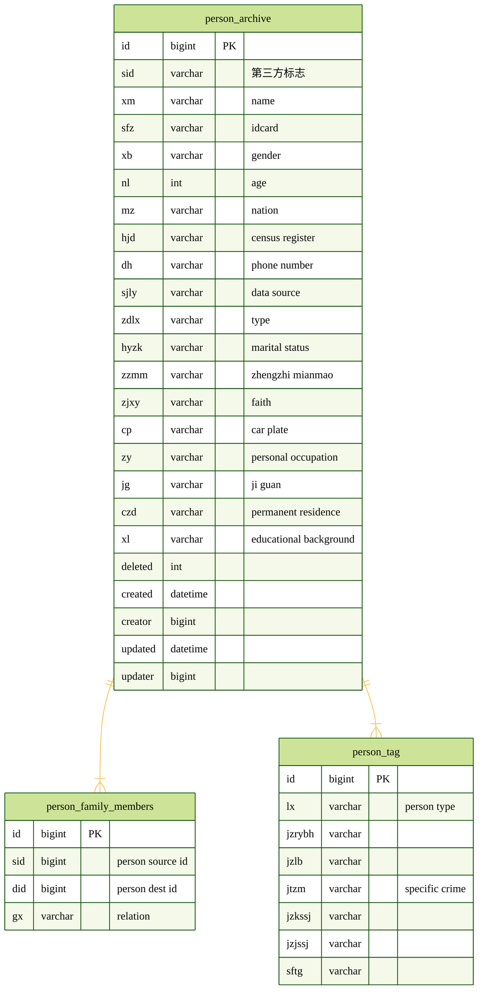
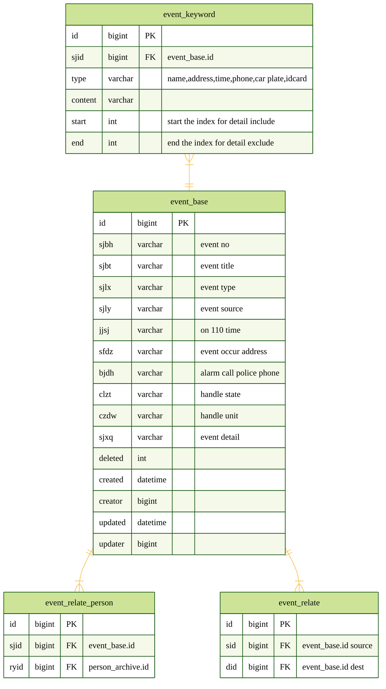

# person_archive

```mermaid
%%{
    init: {
        'theme': 'forest', 
        'themeVariables': { 
            'fontSize': '18px', 
            'fontFamily': 'Consolas',  
            'primaryColor': '#BB2528', 
            'primaryTextColor': '#fff', 
            'primaryBorderColor': '#7C0000', 
            'lineColor': '#F8B229', 
            'secondaryColor': '#006100', 
            'tertiaryColor': '#fff'
        }
    }
}%%

erDiagram
    person_archive {
        id bigint PK
        sid varchar "第三方标志"
        xm varchar "name"
        sfz varchar "idcard"
        xb varchar "gender"
        nl int "age"
        mz varchar "nation"
        hjd varchar "census register"
        dh varchar "phone number"
        sjly varchar "data source"
        zdlx varchar "type"
        hyzk varchar "marital status"
        zzmm varchar "zhengzhi mianmao"
        zjxy varchar "faith"
        cp varchar "car plate"
        zy varchar "personal occupation"
        jg varchar "ji guan"
        czd varchar "permanent residence"
        xl varchar "educational background"
        deleted int
        created datetime
        creator bigint
        updated datetime
        updater bigint
    }    

    person_family_members {
        id bigint PK
        sid bigint "person source id"
        did bigint "person dest id"
        gx varchar "relation"        
    }
    
    person_archive ||--|{ person_family_members: ""

    person_tag {
        id bigint PK
        lx varchar "person type"
        jzrybh varchar 
        jzlb varchar
        jtzm varchar "specific crime"
        jzkssj varchar
        jzjssj varchar
        sftg varchar
    }

    person_archive ||--|{ person_tag: ""

```

# event

```mermaid
%%{
    init: {
        'theme': 'forest', 
        'themeVariables': { 
            'fontSize': '18px', 
            'fontFamily': 'Consolas',  
            'primaryColor': '#BB2528', 
            'primaryTextColor': '#fff', 
            'primaryBorderColor': '#7C0000', 
            'lineColor': '#F8B229', 
            'secondaryColor': '#006100', 
            'tertiaryColor': '#fff'
        }
    }
}%%

erDiagram

    event_keyword }|--|| event_base: ""
    
    event_keyword {
        id bigint PK
        sjid bigint FK "event_base.id"
        type varchar "name,address,time,phone,car plate,idcard"
        content varchar
        start int "start the index for detail include"
        end int "end the index for detail exclude"
    }
    event_base {
        id bigint PK
        sjbh varchar "event no"
        sjbt varchar "event title"
        sjlx varchar "event type"
        sjly varchar "event source"
        jjsj varchar "on 110 time"
        sfdz varchar "event occur address"
        bjdh varchar "alarm call police phone"
        clzt varchar "handle state"
        czdw varchar "handle unit"
        sjxq varchar "event detail"
        deleted int
        created datetime
        creator bigint
        updated datetime
        updater bigint
    }    

    event_base ||--|{ event_relate_person: ""
    event_relate_person {
        id bigint PK
        sjid bigint FK "event_base.id"
        ryid bigint FK "person_archive.id"
    }
   

    event_base ||--|{ event_relate: ""
    event_relate {
        id bigint PK
        sid bigint FK "event_base.id source"
        did bigint FK "event_base.id dest"
    }
    
    

```

314

---
# END