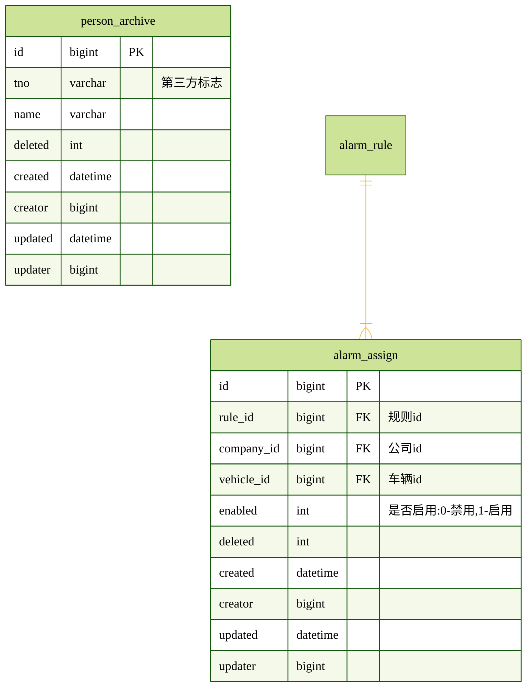

# person_archive


```mermaid
%%{
    init: {
        'theme': 'forest', 
        'themeVariables': { 
            'fontSize': '18px', 
            'fontFamily': 'Consolas',  
            'primaryColor': '#BB2528', 
            'primaryTextColor': '#fff', 
            'primaryBorderColor': '#7C0000', 
            'lineColor': '#F8B229', 
            'secondaryColor': '#006100', 
            'tertiaryColor': '#fff'
        }
    }
}%%

erDiagram
    person_archive {
        id bigint PK
        tno varchar "第三方标志"
        name varchar ""
        deleted int
        created datetime
        creator bigint
        updated datetime
        updater bigint
    }    
    
    alarm_assign {
        id bigint PK
        rule_id bigint FK "规则id"
        company_id bigint FK "公司id"
        vehicle_id bigint FK "车辆id"
        enabled int "是否启用:0-禁用,1-启用"
        deleted int
        created datetime
        creator bigint
        updated datetime
        updater bigint
    }
    alarm_rule ||--|{ alarm_assign: ""
```
```
