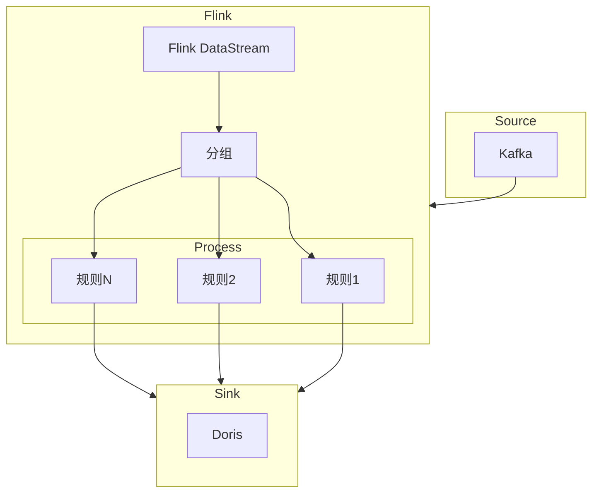

# SQL脚本

>[!info] dev.location_information_test.sql
>此脚本的作用是消费`jtt808`协议上报的`0x0200`位置信息数据并写入到`doris`,
>并且会把最新的上报位置信息输出一份到`kakfa`
>数据经过了转换,得到了设备和公司信息

>[!info] dev.arm_information_test.sql
>此脚本也是处理`jtt808`的消息, 然后保存终端报警数据到`doris`
>只有开始报警时间, 没有结束报警时间

>[!info] dev.ods_om_vehicle_user_test.sql
>同步`MySQL`的车辆用户关系表到`doris`

>[!info] dev.ods_om_vhicle_test.sql
>同步`MySQL`的车辆表到`doris`

>[!info] dev.ods_om_vehicle_device_test.sql
>同步`MySQL`的车辆设备关系表到`doris`

>[!info] dev.ods_om_region_test.sql
>同步`MySQL`的区域表到`doris`

# 报警计算

> 因报警计算的规则较多且复杂, 使用`FlinkSQL`并不能很好的实现.
> 建议使用`Flink DataStream`实时流进行计算, 即写`Flink Java`代码实现.
> 由于我们使用的`Flink`集群是基于`k8s`且`dinky`版本是`0.7.5`, 此版本只能支持`yarn`方式的`flink`集群提交`jar`.
> 建议升级`dinky`到`1.1`

`0.7.5`只支持`yarn`方式把`jar`保存到`hdfs`内.
![[Pasted image 20240912105817.png]]
官方文档说明:

![[Pasted image 20240912110022.png]]