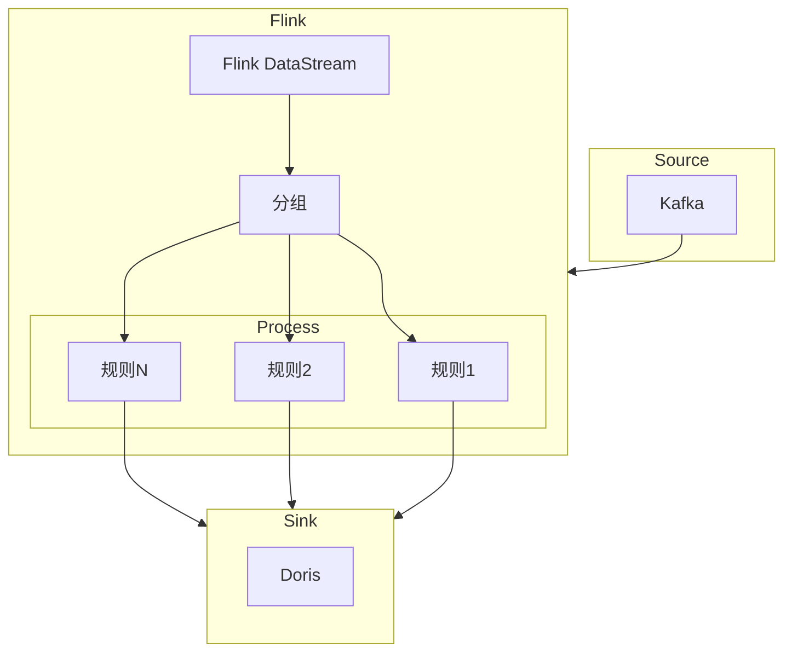

# SQL脚本

>[!info] dev.location_information_test.sql
>此脚本的作用是消费`jtt808`协议上报的`0x0200`位置信息数据并写入到`doris`,
>并且会把最新的上报位置信息输出一份到`kakfa`
>数据经过了转换,得到了设备和公司信息


>[!info] dev.arm_information_test.sql
>此脚本也是处理`jtt808`的消息, 然后保存终端报警数据到`doris`
>只有开始报警时间, 没有结束报警时间


>[!info] dev.ods_om_vehicle_user_test.sql
>同步`MySQL`的车辆用户关系表到`doris`


>[!info] dev.ods_om_vhicle_test.sql
>同步`MySQL`的车辆表到`doris`


>[!info] dev.ods_om_vehicle_device_test.sql
>同步`MySQL`的车辆设备关系表到`doris`


>[!info] dev.ods_om_region_test.sql
>同步`MySQL`的区域表到`doris`


# 报警计算

> 因报警计算的规则较多且复杂, 使用`FlinkSQL`并不能很好的实现.
> 建议使用`Flink DataStream`实时流进行计算, 即写`Flink Java`代码实现.
> 由于我们使用的`Flink`集群是基于`k8s`且`dinky`版本是`0.7.5`, 此版本只能支持`yarn`方式的`flink`集群提交`jar`.
> 建议升级`dinky`到`1.1`





## flink process

![[Pasted image 20240912113520.png]]
> 大多数的规则计算都是如上图所示, 当某个数据满足的前置条件, 持续了时长满足就开始报警: T1,
> 到达解除报警条件就结束报警: T2, 报警时间就是: [T1, T2].

**下面是一个flink处理速度大于60, 且持续20s就报警的例子**

```java

// 根据设备分组
ds.keyBy(X0200::getClientId)
.process(new KeyedProcessFunction<String, X0200, X0200>() {
    private static final long serialVersionUID = 1L;
    // 保存上一次有效数据
    ValueState<X0200> stateLatest;
    // 保存上一次条件命中时间, 此内容包含前置命中和报警命中
    ValueState<Long> stateHitTime;
    // 保存报警的id, 因结束报警需更新结束时间
    ValueState<Long> stateAlarmId;
    
    @Override
    public void open(Configuration parameters) throws Exception {
        // 初始化状态
        stateLatest = getRuntimeContext().getState(xx);
        stateHitTime = getRuntimeContext().getState(xx);
        stateAlarmId = getRuntimeContext().getState(xx);
    }

    @Override
    public void processElement(X0200 value, Context ctx, Collector<X0200> out) throws Exception {
        final long time = value.getDeviceTime().getTime(); 
        // 检查数据是否合法
        // 如数据时间比系统时间大了7天,GPS无效等.
        if (!value.validate()) {
            out.collect(value);
            return; // skip
        }
        // 最近一条数据
        X0200 latest = stateLatest.value();
        if (null == latest) {
            // 如果为空则更新为当前数据
            stateLatest.update(value);
        } else if (time < latest.getDeviceTime().getTime()) {
            // 当前数据时间小于最近一条数据的时间则当前补发数据不做处理
            out.collect(value);
            return;
        }
        // 速度大于60,命中
        if (value.getSpeed() >= 60) {
            Long hit = stateHitTime.value();
            // 命中状态为空表示前置条件命中
            if (null == hit) {
                // 更新命中时间为当前数据时间
                stateHitTime.update(time);
                // 启动一个定时器, 在20秒后触发报警
                // 因为需要持续时间>=20秒
                ctx.timerService()
                .registerProcessingTimeTimer(
                    System.currentTimeMillis() + 20000);
            } 
            // 没有报警id且速度大于60持续了20秒,则报警
            // 有了报警id说明hit时间为报警时间
            else if (time - hit >= 20_000 && null == stateAlarmId.value()) {
                // 报警id生成
                long alarmId = offtenId();
                // 保存报警id
                stateAlarmId.update(alarmId);
                // 根据命中时间为报警时间
                stateHitTime.update(time);
            }
        } else { //速度小于60
            // 报警id不为空, 则更新结束时间
            if (null != stateAlarmId.value()) {
                // update alarm set end time
            }
            // 清除报警id和命中时间
            stateAlarmId.clear();
            stateHitTime.clear();
        }
        // 根据上一次数据计算里程等.
        value.compute(latest);
        // 更新数据
        stateLatest.update(value);
        out.collect(value);
    }

    @Override
    public void onTimer(long timestamp, 
        OnTimerContext ctx, Collector<X0200> out) throws Exception {
        // 定时器触发
        // 如果报警id不为空, 说明数据在process当中已被处理,跳过
        if (null != stateAlarmId.value()) return;
        // 如果命中时间为空则可能数据被处理或者报警不满足,跳过
        if (null == stateHitTime.value()) return;
        // 生成报警id
        long alarmId = offtenId();
        stateAlarmId.update(alarmId);
        // 设置报警时间为触发前置的时间+20秒
        stateHitTime.update(stateHitTime.value() + 20000);
    }
})

.print();
;
;
```


`0.7.5`只支持`yarn`方式把`jar`保存到`hdfs`内.
![[Pasted image 20240912105817.png]]
[官方文档说明](https://www.dinky.org.cn/docs/0.7/administrator_guide/register_center/jar_manager) 

![[Pasted image 20240912110022.png]]