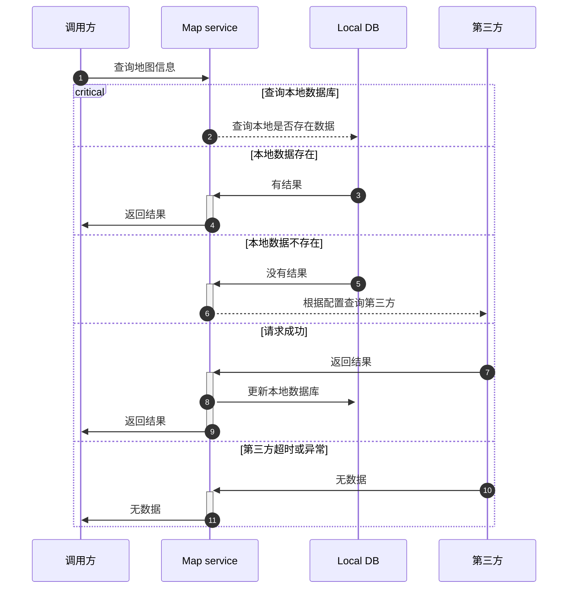
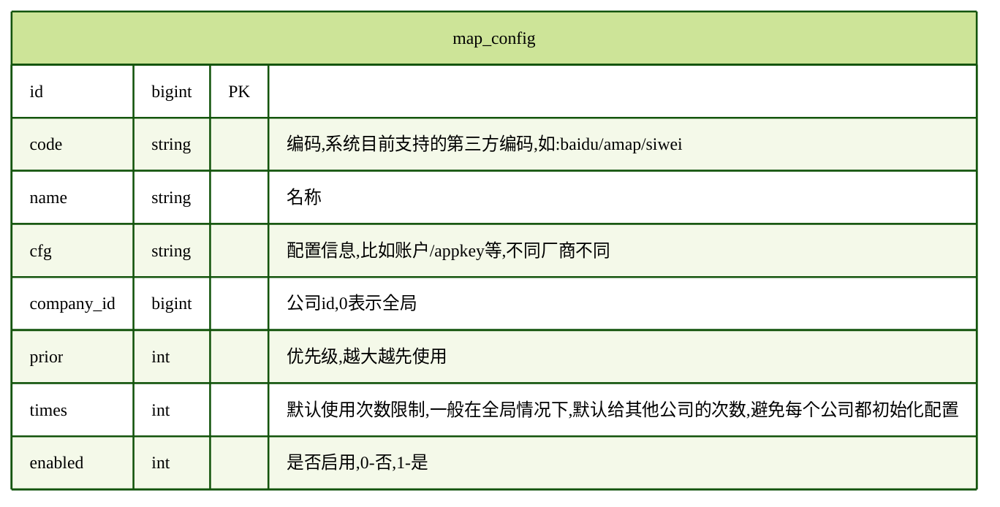
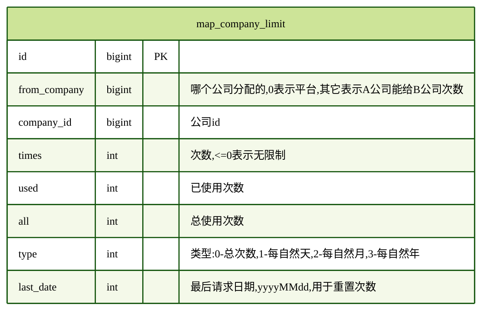
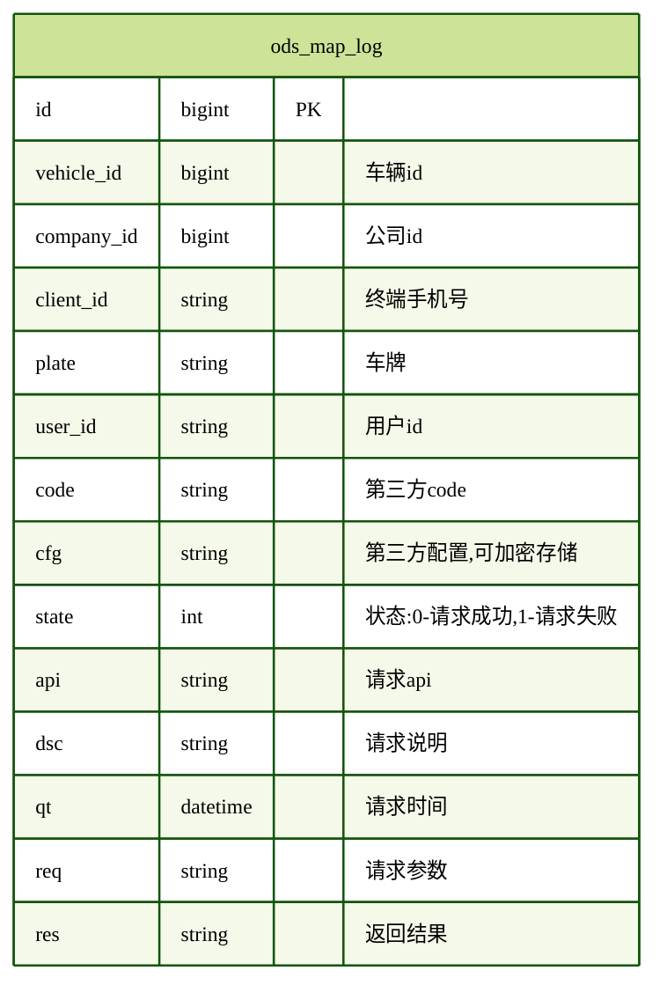
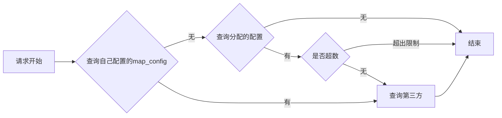
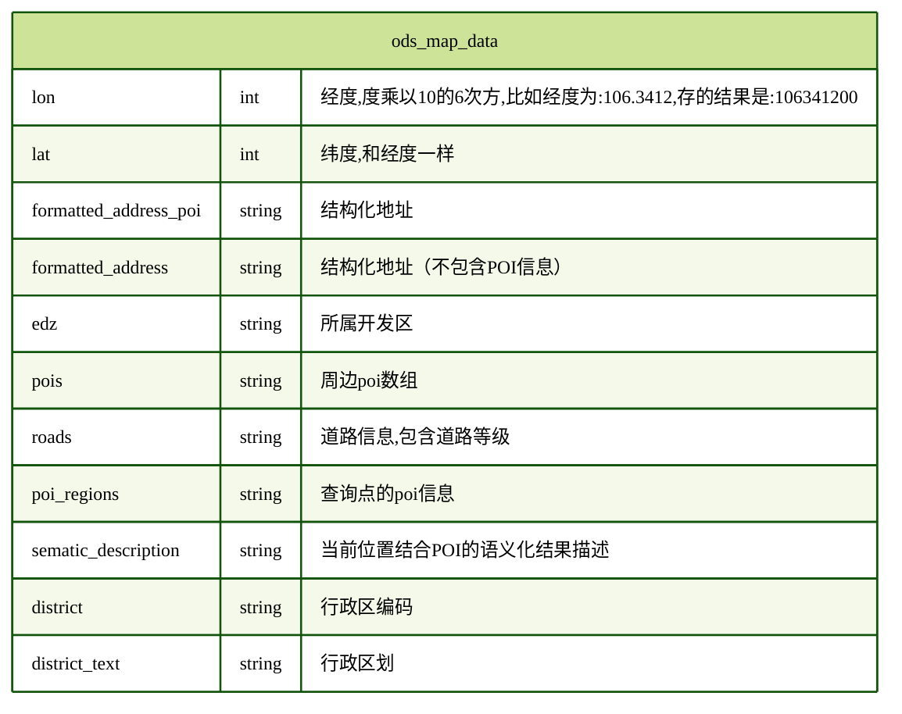

# 功能说明

向上输出一切地图相关信息, 比如经纬度反查地址, 经纬度查询道路等级, 道路查询, 区域行政区查询, 周边范围查询等.
向下对接第三方地图厂商, 可配置化, 支持多个厂商, 不同公司支持自定义资源查询.

# 配置

主要用于配置第三方厂商资源信息, 默认有一个全局配置, 每个`客户`可使用自己的配置.

# 用户次数限制配置

当用户没有配置自定义的地图资源时, 平台给用户分配的资源使用次数

# 请求日志

记录每次请求的日志,方便后续做分析, 计费等.

# 请求流程

# 数据表

存储地图服务的地址信息, 根据**经纬度做唯一约束**

