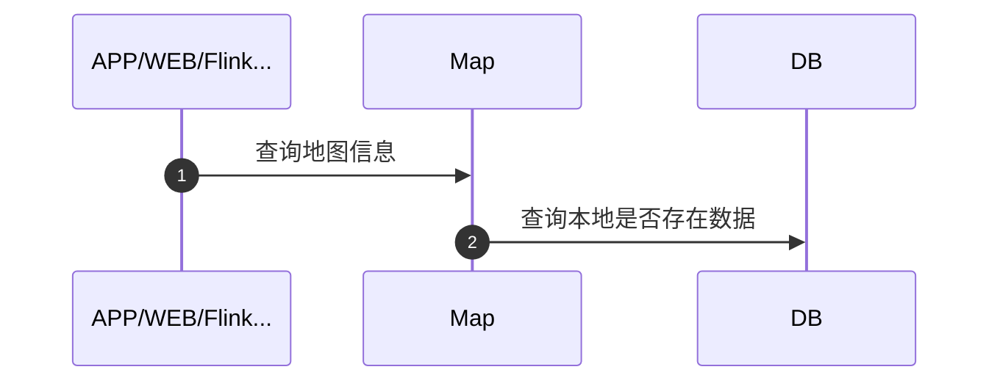

# 功能说明

向上输出一切地图相关信息, 比如经纬度反查地址, 经纬度查询道路等级, 道路查询, 区域行政区查询, 周边范围查询等.
向下对接第三方地图厂商, 可配置化, 支持多个厂商, 不同公司支持自定义资源查询.

```mermaid
sequenceDiagram
  autonumber
  APP/WEB/Flink... ->> Map: 查询地图信息
  Map ->> DB: 查询本地是否存在数据
    
```

