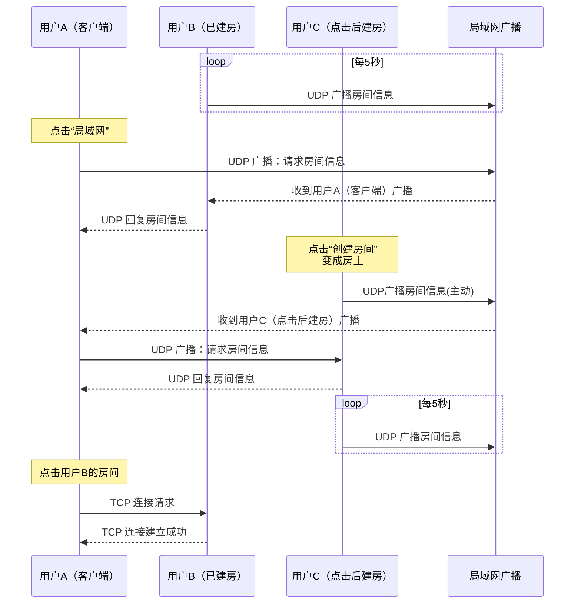

# 通过 Java 实现《魔兽争霸3：冰封王座》局域网连接实战

Updated: 2025-07-16 |  at  15:15

## 1\. 魔兽争霸3 局域网连接流程[#](#1-魔兽争霸3-局域网连接流程)

在局域网中进行《魔兽争霸3：冰封王座》联机时，玩家通过 UDP 广播来查询可用的房间信息，点击房间后通过 TCP 连接进入游戏。

### 流程图[#](#流程图)

可以将以下代码粘贴到 [mermaid](https://mermaid.live/) 进行可视化查看：

## 2\. 系统架构分析[#](#2-系统架构分析)

在实现《魔兽争霸3》局域网联机时，UDP 和 TCP 连接都需要目标 IP 地址。为了避免真实网络的影响，可以使用回环地址（例如 127.0.0.2、127.0.0.3、127.0.0.4）来模拟局域网。

每个回环地址对应一个虚拟的局域网，通过 Java 客户端绑定这些 IP 地址，并监听 TCP 和 UDP 的 6112 端口。所有数据都通过 Java 服务端进行分发。具体过程如下：

1.  客户端通过 UDP 广播请求房间信息；
2.  服务端接收并转发请求，返回房间数据；
3.  客户端发起 TCP 连接请求，进入选定的游戏房间。

### 流程图[#](#流程图-1)

![[Pasted image 20250728110203.png]]
## 3\. 技术要点[#](#3-技术要点)

*   **广播机制**：广播会优先选择最短跳数的网卡。
*   **回环地址**：应用程序可以绑定到回环地址段（如 127.x.x.x），这样就不需要依赖实际的网卡。
*   **魔兽争霸3 配置**：游戏绑定了 `0.0.0.0:6112`，因此客户端和服务器都可以在此端口进行通信。

## 4\. 完整代码[#](#4-完整代码)

完整代码：[https://gitcode.com/qq\_34854236/war3-connection](https://gitcode.com/qq_34854236/war3-connection)

- - -

*    [Java](/tags/java/)
*    [Tcp](/tags/tcp/)
*    [Udp](/tags/udp/)