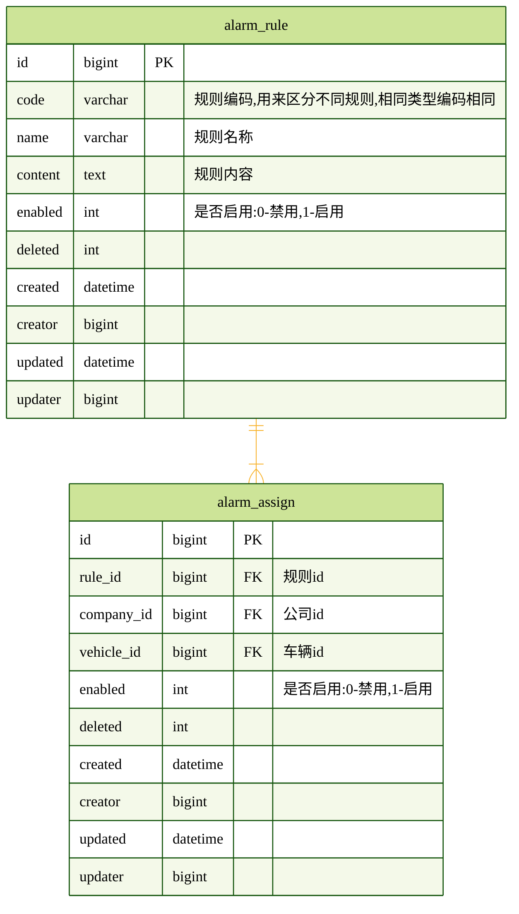

# 报警规则

## 表结构

>[!info] 说明
>因筛选条件只按照规则名称筛选, 所以所有的规则使用同一个表结构, 不同类型的数据序列化会放入数据库里, 业务端需要再反序列化.

**报警规则表**
***

### 语音提示的数据: VoicePrompt

| 字段          | 类型     | 说明                            |
| ----------- | ------ | ----------------------------- |
| voicePrompt | int    | 语音提示,bit:紧急,显示器显示,tts播读,广告屏显示 |
| voiceText   | string | 语音提示内容                        |
| voiceTimes  | int    | 语音提示次数                        |
| voiceGap    | int    | 语音提示间隔                        |

---

## 常规规则

 **数据结构**
***

| 字段                  | 类型  | 说明                                           |
| ------------------- | --- | -------------------------------------------- |
| offlineDuration     | int | 不在线时长                                        |
| offlineLongDuration | int | 长时间不在线时长                                     |
| invalidGPSDuration  | int | 无效定位时长                                       |
| accOnStopDuration   | int | 停车ACC开时长                                     |
| accErrorDuration    | int | ACC异常时长                                      |
| accErrorSpeed       | int | ACC异常速度                                      |
| stopTimeout         | int | 停车超时                                         |
| accOnDuration       | int | acc打开时长                                      |
| accOnMileage        | int | acc打卡时里程                                     |
| alarmEnabled        | int | 是否报警                                         |
| alarmType           | int | 设备报警类型,bit:离线,长时间离线,位置信息异常,停车acc开,acc异常,停车超时 |
| ... VoicePrompt     |     | 语音提示                                         |

**报警规则**
***

> [!info]-  1 不在线时长对应离线报警
> 设备状态为离线时开始计时，当计时离线时长>=`offlineDuration`，产生离线报警。当设备状态
为在线时、或人工手动处理后解除报警. 
>> [!error] 需要注意当人工处置后, 如果还是收到离线报文应该重置离线时长

> [!info]- 2 长时间不在线时长对应长时间离线报警
> 设备状态为离线时开始计时，当计时离线时长>=`offlineLongDuration`，产生离线报警。当设备状态
为在线时、或人工手动处理后解除报警。 备注:报警处理时无法与设备交互，因此设备
交互的处理内容去掉。`offlineLongDuration > offlineDuration`。
>> [!done] 算法和不在线时长一样

> [!info]- 3 无效定位持续时长对应位置信息异常报警
> 当GPS上报的经纬度是(0,0), 或者`invalidGPSDuration`期间全部上传未定位状态位置信息时产生报警. 当终端正常上报位置信息时或手工处理时解除报警
> >[!error] 手工处理时应处置时长

>[!info]- 4 停车ACC开时长对应停车ACC开报警
>当设备状态为停车-ACC开时开始计时, 当计时时长>=`accOnStopDuration`, 且速度为0时, 产生停车ACC开报警. 当有速度大于10km/h时解除报警.

>[!info]- 5 ACC异常时间, ACC异常速度对应ACC信号异常报警
>当车辆用带点火开关的转向锁的专用档位(简称ACC)处于关闭状态, 车辆连续`accErrorDuration`时间速度大于`accErrorSpeed`应产生报警

>[!info]- 6 停车超时对应停车超时报警
>设备状态为停车时开始计时, 当计时时长>=`stopTimeout`, 产生报警, 当状态变更为行驶或离线或人工处理时解除报警.
>>[!error] 人工处理后需重置时长

>[!info]- 7 在运行车辆离线
>一天内累计ACC开`accOnDuration`时长的情况下同时满足行驶里程`小于` `accOnMileage`,则产生在运行车辆离线报警

---
## 疲劳规则

**数据结构**
***

| 字段                | 类型          | 说明             |
| ----------------- | ----------- | -------------- |
| runDuration       | int         | 持续行驶时长         |
| restDuration      | int         | 休息时长           |
| accReset          | int         | acc熄火是否重新计算    |
| alarmEnabled      | int         | 是否报警           |
| fatigueVoice      | VoicePrompt | 疲劳语音提示         |
| nightStart        | int         | 夜间开始时间:HHmmss  |
| nightEnd          | int         | 夜间结束时间:HHmmss  |
| nightRunDuration  | int         | 夜间持续行驶时长       |
| nightRestDuration | int         | 夜间休息时长         |
| nightAccReset     | int         | 夜间acc喜熄火是否重新计算 |
| nightAlarmEnabled | int         | 夜间是否报警         |
| nightVoice        | VoicePrompt | 夜间语音提示         |
| remindEnabled     | int         | 是否预警           |
| remindTime        | int         | 提前预警时间         |
| remindVoice       | VoicePrompt | 预警语音提示         |

**报警规则**
***

>[!info]- 1 疲劳规则对应疲劳驾驶报警
>当行驶速度>=10km/h(默认值)时，开始计时行驶持续时长，当行驶持续时长>=`runDuration`产生报警，当行驶速度小于10km/h开始计时休息时长，当休息时长>=`restDuration`，解除报警。如果休息时长未达到预设值继续行驶，则休息时长清零。如果平台处理了报警，且实际疲劳未满足解除规则，则报警数据依然要产生，不通知平台。如果ACC熄火重新计算被选中，则当ACC关闭后计时全部清零，重新计算,车辆ACC熄火则重新计算时长，连续驾驶时长低于预设值，休息时长满足预设值及以上行驶则不产生疲劳报警.

>[!info]- 2 夜间疲劳报警
>>[!error] 和疲劳规则一样, 只是增加了时间段, 在此时间段内只产生夜间疲劳预警

>[!info]- 3 疲劳规则预警
>对疲劳规则报警和夜间疲劳规则报警进行预警. 在到达报警前`remindTime`先预警

---

## 超速规则

**数据结构**
***

| 字段                 | 类型          | 说明                         |
| ------------------ | ----------- | -------------------------- |
| areaType           | int         | 区域类型:0-自定义,1-行政区域          |
| inId               | string      | 区域id                       |
| inName             | string      | 区域名称                       |
| outId              | string      | 干扰区域id                     |
| outName            | string      | 干扰区域名称                     |
| provinceCode       | string      | 省编码                        |
| cityCode           | string      | 市编码                        |
| countyCode         | string      | 区编码                        |
| speedMax           | int         | 速度阈值                       |
| speedDuration      | int         | 超速持续时长                     |
| alarmEnabled       | int         | 是否报警:0-不报警,1-报警1次,2-间隔报警   |
| gapTime            | int         | 间隔报警时间                     |
| gapTimes           | int         | 间隔报警次数                     |
| alarmVoice         | VoicePrompt | 报警语音提示                     |
| remindEnabled      | int         | 是否预警                       |
| remindSpeed        | int         | 预警速度                       |
| remindDuration     | int         | 预警速度持续时长                   |
| remindAlarmEnabled | int         | 预警是否报警:0-不报警,1-报警1次,2-间隔报警 |
| remindGapTime      | int         | 预警报警间隔时间                   |
| remindGapTimes     | int         | 预警报警次数                     |
| remindVoice        | VoicePrompt | 预警语音提示                     |

**报警规则**
***
> [!info]- 1 超速报警规则
> 当车辆进入区域, 行驶速度>=`speedMax`, 并且持续时长>=`speedDuration`时, 触发报警. 当速度<`speedMax`, 或者车辆离开区域, 或者车辆进入干扰区域, 或人工处理后解除报警.
> >[!error] 人工解除后, 车辆如果仍然没有到达非人工解除条件, 报警数据依然会产生. 不会平台提醒.

>[!info]- 2 超速预警规则
>超速预警规则和报警规则一样, 只是`speedMax`换成`remindSpeed`, `speedDuration`换成`remindDuration`. 并且`remindSpeed < speedMax`.

## 道路限速规则

**数据结构**
***

| 字段                     | 类型     | 说明             |
| ---------------------- | ------ | -------------- |
| highway                | int    | 高速公路           |
| national               | int    | 国道             |
| provincial             | int    | 省道             |
| county                 | int    | 县道             |
| other                  | int    | 其他             |
| duration               | int    | 持续时长           |
| roadPrompt             | string | 语音提示内容         |
| nightStart             | int    | 夜间开始:HHmmss    |
| nightEnd               | int    | 夜间结束:HHmmss    |
| nightLimit             | int    | 夜间限速           |
| nightStartTime         | date   | 开始时间           |
| nightEndTime           | date   | 结束时间           |
| nightPrompt            | string | 夜间语音提示内容       |
| forbidHighwayStart     | int    | 禁止上高速开始:HHmmss |
| forbidHighwayEnd       | int    | 禁止上告诉结束:HHmmss |
| forbidHighwayStartTime | date   | 禁止上高速开始时间      |
| forbidHighwayEndTime   | date   | 禁止上高速结束时间      |
| forbidHighwayPrompt    | string | 禁止上高速语音提示内容    |
| remindDiff             | int    | 预警差值           |
| forbidNightStart       | int    | 夜间禁行开始:HHmmss  |
| forbidNightEnd         | int    | 夜间禁行结束:HHmmss  |
| forbidNightStartTime   | date   | 夜间禁行开始时间       |
| forbidNightEndTime     | date   | 夜间禁行结束时间       |
| forbidNightPrompt      | string | 夜间禁行语音提示       |

**报警规则**
***

>[!info]- 1 道路等级限速规则
>根据车辆行驶的道路类型(依赖地图接口查询), 根据不同类型设置的限速阈值进行判定, 当速度>=阈值, 并且持续时间>=`duration`,则产生报警, 当速度小于阈值或者人工处理后解除报警

>[!info]- 2 夜间限速规则
>当时间在夜间段`[nightStart, nightEnd]`, 并且时间在`[nightStartTime, nightEndTime]`之间, 根据道路类型的限速`*nightLimit`得到夜间限速值, 当前速度>限速值时则报警, 解除报警也是按照计算的夜间限速值进行判断

>[!info]- 3 夜间禁止上高速规则
>当时间在`[forbidHighwayStart,forbidHighwayEnd]`并且时间在`[forbidHighwayStartTime,forbidHighwayEndTime]`时, 车辆驶入高速则报警

> [!info]- 4 道路限速预警规则
> 和报警一样, 只是速度计算方式为报警设置的速度-`remindDiff`得到预警限速.

> [!info]- 5 夜间进行规则
> 当时间在`[forbidNightStart, forbidNightEnd]`和`[forbidNightStartTime, forbidNightEndTime]`,车辆在行驶状态产生告警, 车辆不行驶或人工处理后解除报警

## 区域规则

**数据结构**
***

| 字段              | 类型     | 说明                      |
| --------------- | ------ | ----------------------- |
| type            | int    | 规则类型:0-禁止进入,1-禁止离开,2-进出 |
| areaType        | int    | 区域类型:0-自定义,1-行政区        |
| areaId          | string | 区域id,自定义时               |
| areaName        | string | 区域名称                    |
| provinceCode    | string | 省编码                     |
| cityCode        | string | 市编码                     |
| countyCode      | string | 区编码                     |
| duration        | int    | 持续时长                    |
| start           | date   | 开始时间                    |
| end             | date   | 结束时间                    |
| alarmEnabled    | int    | 是否报警                    |
| ... VoicePrompt |        | 语音提示                    |

**报警规则**
***

>[!info]- 1 禁止进入区域
>当`type=0`, 并且当前时间在`[start, end]`, 并且`进入到区域`, 并且停留时长`>=duration`则产生报警, 离开区域, 或者 不在`[start, end]`, 或者人工处理后解除报警

>[!info]- 2 禁止离开区域规则
>当`type=1`, 并且当前时间在`[start, end]`, 并且`不在区域`, 并且时长`>=duration`则产生报警, 当进入区域, 或者不在时间段内, 或者人工处理则解除报警

>[!info]- 3 进出区域规则
>当`type=2`,时间在`[start, end]`, 车辆`进入区域`或者`离开区域`就产生报警,不做持续报警.
>>[!faq] 此报警是否就是一个时间点的报警, 所以不会有解除规则

## 线路关键点规则

**数据结构**
***

| 字段         | 类型     | 说明                           |
| ---------- | ------ | ---------------------------- |
| lineId     | string | 线路id                         |
| lineName   | string | 线路名称                         |
| points     | [      | 关键点数组                        |
| name       | string | 关键点名称                        |
| radius     | int    | 半径                           |
| lng        | int    | 经度                           |
| lat        | int    | 纬度                           |
| in         | int    | 到达时间:HHmmss                  |
| out        | int    | 离开时间:HHmmss                  |
|            | ]      |                              |
| notInText  | string | 未到达语音内容                      |
| notOutText | string | 未离开语音内容                      |
| voiceType  | int    | 语音提示bit:紧急,显示器显示,tts播读,广告屏显示 |

>[!info]- 1 报警规则
>当车辆在未按关键点设置的到达时间和离开时间驶入和驶离指定范围则产生报警, 不做持续报警

## 偏离路线规则

**数据结构**
***

| 字段              | 类型     | 说明   |
| --------------- | ------ | ---- |
| lineId          | string | 线路id |
| lineName        | string | 线路名称 |
| deviate         | int    | 偏离宽度 |
| start           | date   | 开始时间 |
| end             | date   | 结束时间 |
| alarmEnabled    | int    | 是否报警 |
| ... VoicePrompt |        | 语音提示 |

>[!info]- 报警规则
>在指定时间段内`[start, end]`, 车辆未行驶在指定线路中产生报警. 车辆驶入线路或人工处理后解除报警

## 驾驶员登退签规则

**数据结构**
***

| 字段             | 类型     | 说明                              |
| -------------- | ------ | ------------------------------- |
| start          | int    | 开始时间:HHmmss                     |
| end            | int    | 结束时间:HHmmss                     |
| inPlay         | int    | 登签播报:0-否,1-是                    |
| inVoicePrompt  | int    | 登签语音提示,bit:紧急,显示器显示,tts播读,广告屏显示 |
| inVoiceText    | string | 登签语音内容                          |
| outPlay        | int    | 退签是否播报                          |
| outVoicePrompt | int    | 退签语音提示,bit                      |
| outVoiceText   | string | 退签语音内容                          |
>[!info]- 规则
>登签是在规定时间内, 将驾驶员卡插入设备时, 可选择语音播示.
>退签是在规定时间内, 将驾驶员卡插入设备时, 可选择语音播示.
>设备会推送登签退签的记录

## 报警等级

> [!info] 说明
> 报警等级里面有疲劳和超速报警, 其报警规则与`疲劳驾驶`,`超速驾驶`互不干扰.
> 比如这里的疲劳驾驶只需设置持续时长, 速度则是默认的10km/h.
> 然后根据设置的不同条件提示不同的内容

**数据结构**
***

| 字段          | 类型     | 说明                           |
| ----------- | ------ | ---------------------------- |
| src         | int    | 报警来源:0-全部,1-设备,2-平台          |
| type        | int    | 报警类型:0-疲劳驾驶,1-超速驾驶           |
| level       | [      | 等级报警                         |
| code        | string | 类型                           |
| name        | string | 类型名称                         |
| level       | int    | 等级                           |
| speed       | int    | 速度阈值, 当为疲劳驾驶时固定为10km/h       |
| duration    | int    | 持续时长                         |
| voicePrompt | int    | 语音提示bit:紧急,显示器显示,tts播读,广告屏显示 |
| content     | string | 内容                           |
| target      | string | 发送目标, 不同类型不同目标               |
|             | ]      |                              |

# 历史回放

> 查询某个车辆的某个时间段的轨迹信息做分析

## 轨迹点

- 增加了平台总程, 需给出算法
- 报警是否包含平台报警
- 轨迹分析的里程计算规则: 行驶里程数=选择的时间定位数-1?
- 平均速度=速度总和/定位总数?

## 停车点

- 增加已行驶里程和距前停里程
- 位置中文可能需要调用第三方接口根据经纬度查询地址

## 报警明细

- 包含平台报警和终端报警
  

## 速度分析

> 前端自己处理
- 需要展示位置信息, 通过经纬度拿到位置

## 停车分析

- 离线报警数据
- 疲劳预警数据
- 可以实时获取终端报警参数. 0x8201指令?

## 区域分析

> 是不是只需区域多边形数据, 前端根据轨迹计算?

## 离线明细

> 离线列表数据

## 司机登签

> 登签数据查询

## 异常分析

- 补报定位: 返回的数据是根据定位时间正序的. 循环判断定位如果当前定位的平台时间大于下一个定位的平台时间, 则说明当前定位是补报.
- 无效定位: 判断经纬度=0,0, 或者状态信息的定位状态未定位(这个是在协议定义的)
- 时间异常/里程异常/中断分析都可以根据需求计算

## 异常里程

> 这个需要知道平台里程算法

